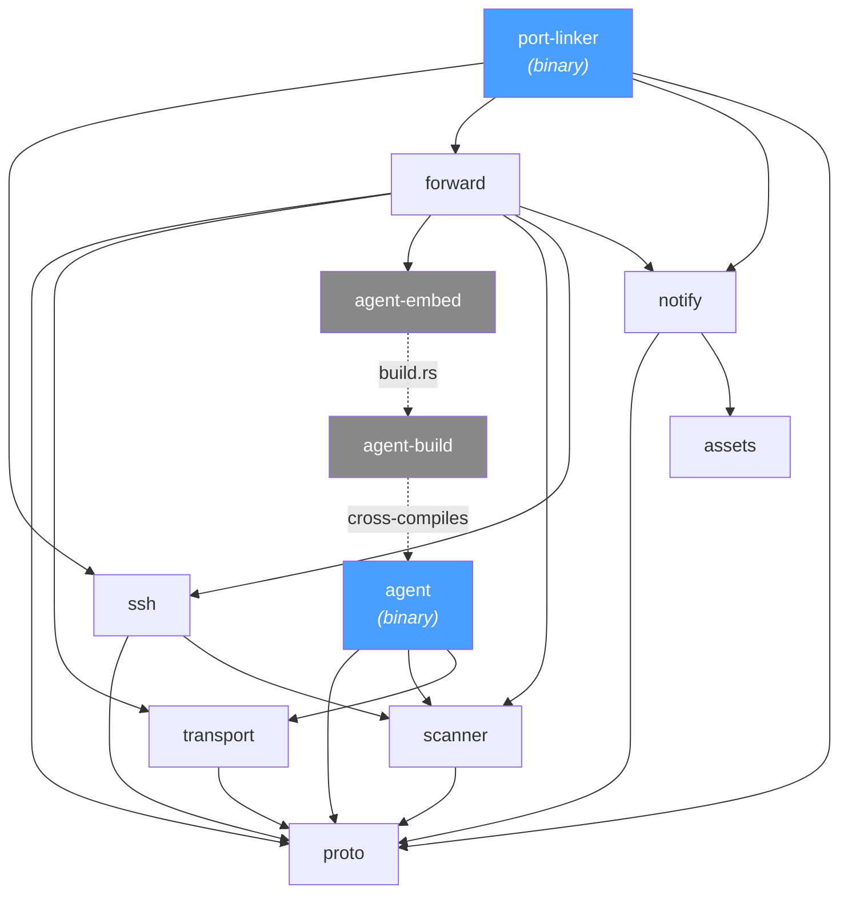
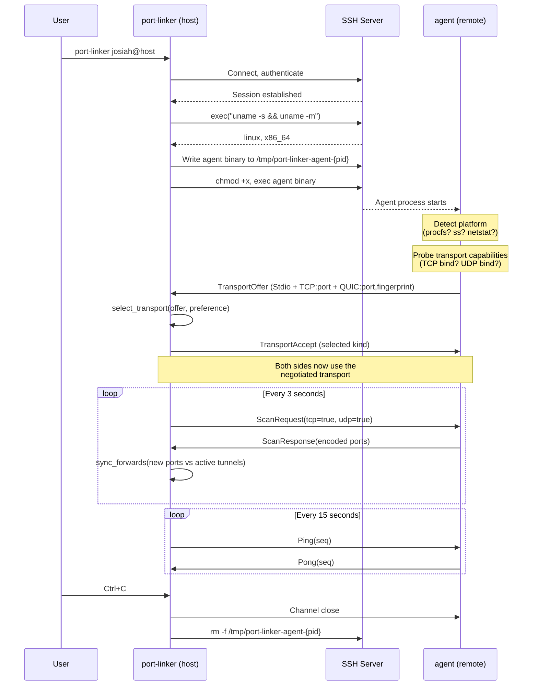
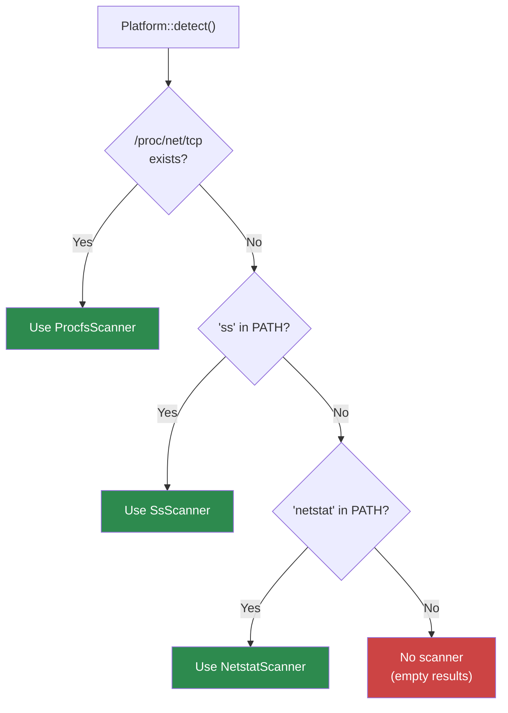
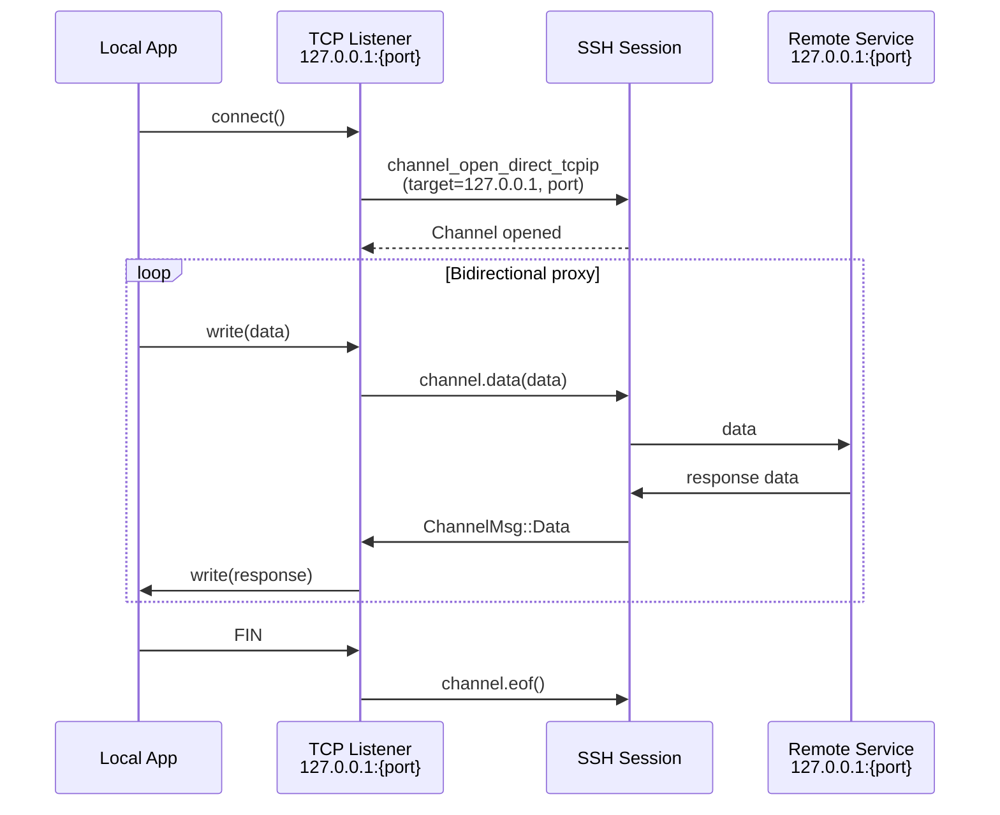
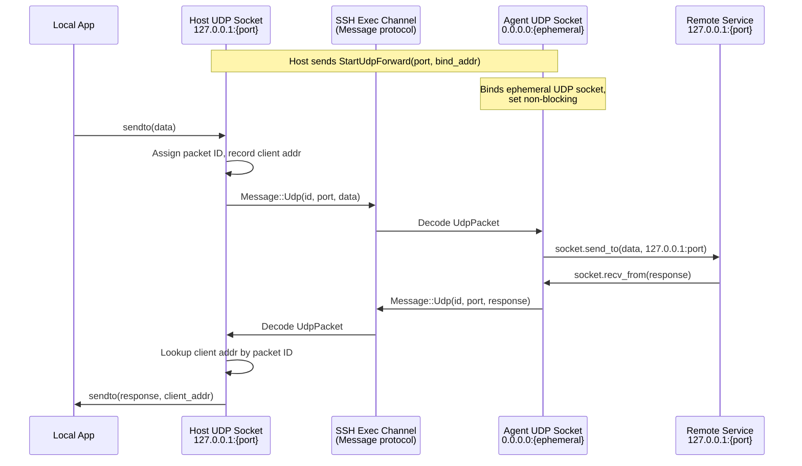
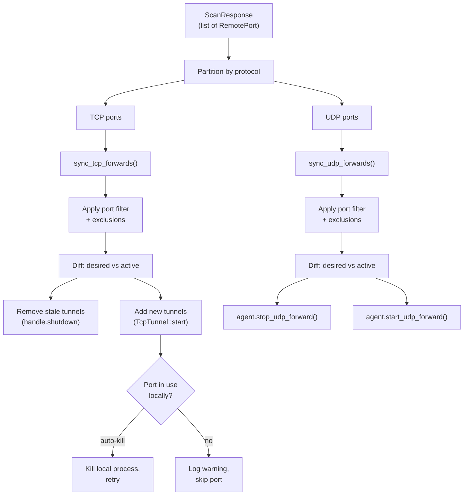
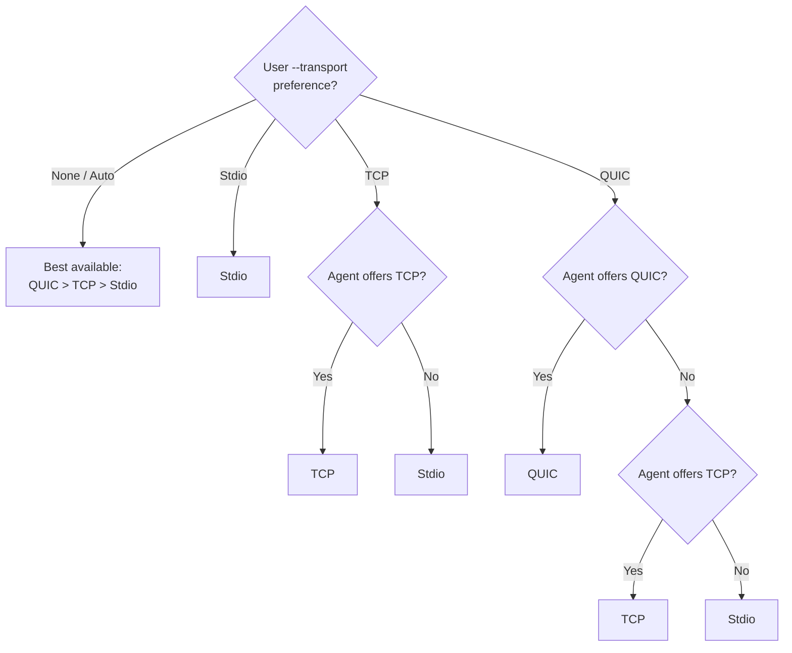
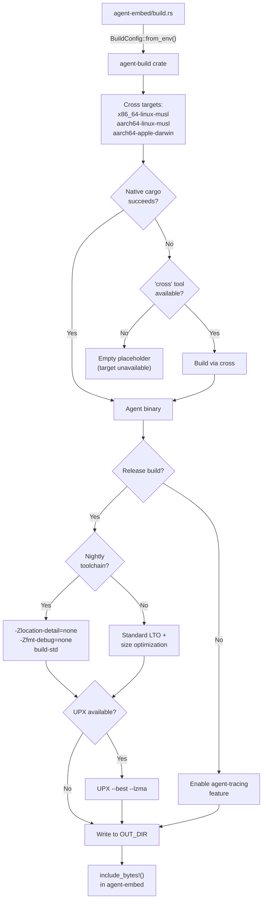

# Architecture

This document describes the internal architecture of port-linker: how the workspace is organized, how the host and agent communicate, how ports are discovered and forwarded, and how logging works across the SSH boundary.

## Table of Contents

- [Workspace Layout](#workspace-layout)
- [Dependency Graph](#dependency-graph)
- [Startup and Negotiation](#startup-and-negotiation)
- [Port Scanning](#port-scanning)
- [Port Forwarding](#port-forwarding)
- [Wire Protocol](#wire-protocol)
- [Transport Negotiation](#transport-negotiation)
- [Logging](#logging)
- [Build Pipeline](#build-pipeline)

---

## Workspace Layout

The project is a Cargo workspace with 10 crates under `crates/`. Two are binaries (the host CLI and the remote agent); the rest are libraries.

| Crate | Type | Purpose |
|---|---|---|
| `port-linker` | binary | Main CLI. Parses args, connects via SSH, deploys the agent, runs the monitoring loop. |
| `agent` | binary | Lightweight binary deployed to the remote host. Handles port scanning, UDP forwarding, and transport negotiation. |
| `agent-build` | library | Reusable cross-compilation infrastructure. Drives `cargo`/`cross`, applies size optimizations, runs UPX. |
| `agent-embed` | library | Embeds pre-compiled agent binaries via `include_bytes!`. Build script invokes `agent-build`. |
| `forward` | library | Tunnel management. `ForwardManager` coordinates TCP tunnels (via SSH direct-tcpip) and UDP tunnels (via the agent). Contains `AgentSession` for host-side agent communication. |
| `transport` | library | `Transport` trait and implementations (Stdio, TCP, QUIC). Transport negotiation protocol. QUIC TLS config with TOFU fingerprint verification. |
| `proto` | library | Wire protocol definitions. Zero external dependencies to keep the agent binary small. All message types, TLV encoding/decoding. |
| `scanner` | library | Platform-aware port scanning. Procfs, `ss`, and `netstat` backends. Binary serialization for scan results. |
| `ssh` | library | SSH client wrapper around `russh`. Connection management, remote command execution, SSH config parsing, local process detection for port conflicts. |
| `notify` | library | Desktop notifications (`notify-rust`) and port description mapping (human-readable service names). |
| `assets` | library | Renders `assets/logo.svg` to PNG at 64/128/256px via `resvg` at build time. Embedded into `notify` for notification icons. |

---

## Dependency Graph



Dashed lines are build-time dependencies. `agent-embed`'s build script uses `agent-build` to cross-compile the `agent` binary, then embeds the resulting bytes with `include_bytes!`.

### Key design constraints

- **`proto` has zero external dependencies.** It is shared between host and agent, and keeping it dependency-free minimizes agent binary size.
- **`scanner` depends only on `proto`.** Platform-specific scanning uses raw syscalls (`/proc` reads, `posix_spawnp`) instead of heavy crates.
- **`agent` avoids workspace-wide dependencies** like `tokio`, `russh`, and `clap`. It uses synchronous, single-threaded I/O to stay small.

---

## Startup and Negotiation



### Startup phases

1. **SSH connection** — The CLI parses `~/.ssh/config`, resolves the host, authenticates (key or interactive), and establishes a session.
2. **Platform detection** — Runs `uname -s` and `uname -m` over SSH to determine the remote OS and architecture.
3. **Agent deployment** — Retrieves the matching embedded binary from `agent-embed`, writes it to `/tmp` via SFTP, and `chmod +x`'s it.
4. **Agent launch** — Opens an SSH exec channel running the agent binary. The agent's stdout/stdin become the host's communication channel.
5. **Transport negotiation** — The agent probes what it can bind (TCP listener, UDP socket for QUIC) and sends a `TransportOffer`. The host selects the best available transport and responds with a `TransportAccept`. See [Transport Negotiation](#transport-negotiation) for details.
6. **Monitoring loop** — The `Monitor` periodically sends `ScanRequest` messages, diffs the results against active tunnels, and creates or tears down forwards as needed.

### Agent recovery

If the agent dies (healthcheck timeout or channel close), the monitor detects this during `check_agent_health()`, cleans up the old binary, and redeploys a fresh agent. If redeployment fails, scanning falls back to running `ss`/`netstat` over SSH exec channels.

### Connection recovery

If the SSH connection drops, the monitor enters an exponential-backoff reconnection loop (1s, 2s, 4s, ... up to 60s). On reconnection, it updates the SSH handle and re-establishes all tunnels.

---

## Port Scanning

Port scanning runs on the remote agent. The host sends a `ScanRequest` message with flags indicating which protocols to scan (TCP, UDP, or both). The agent runs the best available scanner and returns a `ScanResponse` containing a binary-encoded list of discovered ports.

### Scanner selection

Scanners are tried in priority order. The first one whose `valid_platform()` check passes is used for the session lifetime.



### Platform matrix

| Scanner | Linux | macOS | FreeBSD | Method |
|---|:---:|:---:|:---:|---|
| **procfs** | Yes | - | - | Reads `/proc/net/{tcp,udp}{,6}` directly. Resolves process names via `/proc/[pid]/fd/` inode mapping. |
| **ss** | Fallback | If available | If available | Runs `ss -tlnp` / `ss -ulnp`. Parses tabular output. |
| **netstat** | Fallback | Fallback | Fallback | Runs `netstat -tlnp` / `netstat -ulnp`. Parses tabular output. |

### procfs scanner (Linux, preferred)

The procfs scanner is the fastest option because it avoids spawning subprocesses.

1. **Read entries** — Reads `/proc/net/tcp` and `/proc/net/tcp6` (for TCP) or `/proc/net/udp` and `/proc/net/udp6` (for UDP).
2. **Filter by state** — TCP: keeps only state `0A` (LISTEN). UDP: keeps only state `07` (unconn).
3. **Parse hex addresses** — The local address field is a hex-encoded IP:port. IPv4 addresses are little-endian u32s. IPv6 addresses are four little-endian u32s. IPv4-mapped IPv6 (`::ffff:x.x.x.x`) is normalized.
4. **Filter by bind address** — Only "forwardable" addresses are kept: `0.0.0.0`, `127.0.0.1`, `::`, `::1`. Ports bound to specific non-loopback addresses (e.g., `192.168.1.5`) are excluded.
5. **Resolve process names** — Builds a map of socket inode → process name by scanning `/proc/[pid]/fd/` for `socket:[inode]` symlinks, then reading `/proc/[pid]/comm`.
6. **Deduplicate** — Sorts by port and deduplicates (a port listening on both `0.0.0.0` and `::` appears once).

### ss / netstat scanners

These run as subprocesses via `posix_spawnp()` (not `std::process::Command`, to minimize agent binary size). They parse the tabular output, extract address:port pairs and optional process names, apply the same forwardability filter, and deduplicate.

### Scan result encoding

Scan results are serialized into a compact binary format for transmission:

```
[count: 2 bytes BE]
[entry_1] [entry_2] ... [entry_N]

Each entry:
  [protocol: 1]           0=TCP, 1=UDP
  [port: 2 BE]
  [addr_type: 1]          4=IPv4, 6=IPv6
  [addr: 4 or 16 bytes]   network byte order
  [name_len: 1]           0-255
  [name: variable]        UTF-8 process name
```

---

## Port Forwarding

### TCP forwarding

TCP ports are forwarded using SSH's `direct-tcpip` channel type (RFC 4254). Each forwarded port gets its own local TCP listener and spawned task.



**Key details:**

- Local listeners bind to `127.0.0.1` only (no external exposure).
- Wildcard remote addresses (`0.0.0.0`, `::`, `*`) are normalized to `127.0.0.1` for the `direct-tcpip` target.
- Each accepted connection opens a dedicated SSH channel and spawns a bidirectional copy loop with a 32KB buffer.
- Tunnel handles support graceful shutdown via a `oneshot` channel.

### UDP forwarding

UDP cannot use SSH's `direct-tcpip` channels (TCP only). Instead, UDP packets are multiplexed over the agent's SSH exec channel using `Message::Udp` frames.



**Key details:**

- The host maintains a `HashMap<u32, SocketAddr>` mapping packet IDs to client addresses, so responses are routed back to the correct local client.
- The agent binds an ephemeral UDP socket (`0.0.0.0:0`) for each forwarded port and routes packets to `127.0.0.1:{port}`.
- The agent polls all UDP sockets in its main loop (non-blocking with `recv_from`), then flushes responses as `Message::Udp` frames.
- `StartUdpForward` / `StopUdpForward` messages control the agent's socket lifecycle.

### ForwardManager coordination

The `ForwardManager` is the central coordinator. On each scan cycle it receives the current list of remote ports and synchronizes the active tunnels:



Default excluded ports: 22 (SSH), 53 (DNS), 111 (RPC), 631 (CUPS), 5353 (mDNS), 41641 (Tailscale).

---

## Wire Protocol

All host-agent communication uses a TLV (type-length-value) format defined in the `proto` crate. Every message starts with a 1-byte type and a 4-byte big-endian length, followed by the payload.

```
┌──────────┬──────────────┬─────────────────────┐
│ type (1) │ length (4 BE)│ payload (variable)   │
└──────────┴──────────────┴─────────────────────┘
```

### Message types

| Type | ID | Payload | Direction |
|---|---|---|---|
| `UdpPacket` | `0x00` | `[src_port:2][dst_port:2][id:4][data:N]` | Both |
| `Ping` | `0x01` | `[value:8]` | Host → Agent |
| `Pong` | `0x02` | `[value:8]` | Agent → Host |
| `ScanRequest` | `0x03` | `[flags:1]` (bit 0=TCP, bit 1=UDP) | Host → Agent |
| `ScanResponse` | `0x04` | `[encoded_ports:N]` (see [Scan result encoding](#scan-result-encoding)) | Agent → Host |
| `StartUdpForward` | `0x05` | `[port:2][addr_type:1][addr:4\|16]` | Host → Agent |
| `StopUdpForward` | `0x06` | `[port:2]` | Host → Agent |
| `LogBatch` | `0x07` | `[count:2][event_1]...[event_N]` | Agent → Host |

### Negotiation message types

These share the same TLV framing but use distinct type bytes to avoid collision with `proto::Message`:

| Type | ID | Payload |
|---|---|---|
| `TransportOffer` | `0x10` | `[version:4][count:1][entries...]` where each entry is `[kind:1][data_len:2 BE][data:N]` |
| `TransportAccept` | `0x11` | `[kind:1]` |

The first byte of any message distinguishes negotiation traffic (`0x10`/`0x11`) from normal protocol traffic (`0x00`-`0x07`), allowing backward-compatible detection of agents that don't support negotiation.

---

## Transport Negotiation

After the agent starts, it probes its local capabilities and advertises them to the host via a `TransportOffer`. The host selects the best option and responds with a `TransportAccept`.

### Available transports

| Transport | Kind byte | Offer data | Description |
|---|---|---|---|
| **Stdio** | `0x00` | (none) | SSH exec channel stdin/stdout. Always available. Maximum compatibility. |
| **TCP** | `0x01` | `[port:2 BE]` | TCP socket via SSH `direct-tcpip`. Agent binds a TCP listener; host connects through SSH. |
| **QUIC** | `0x02` | `[port:2 BE][fingerprint:32]` | QUIC over UDP, bypassing SSH for the data path. Self-signed cert with SHA-256 fingerprint delivered over the authenticated SSH channel (TOFU). |

### Selection logic



### QUIC trust model

QUIC uses self-signed certificates generated at agent startup. Trust is bootstrapped via the SSH channel:

1. Agent generates a self-signed certificate with `rcgen` and computes its SHA-256 fingerprint with `ring`.
2. The fingerprint is included in the `TransportOffer` data (32 bytes after the port).
3. The host builds a `rustls` `ClientConfig` with a custom `ServerCertVerifier` (`FingerprintVerifier`) that validates only that the server certificate's SHA-256 hash matches the expected fingerprint.
4. This is a Trust On First Use (TOFU) model — the fingerprint is trusted because it was delivered over the authenticated SSH session.

---

## Logging

Logging spans two processes (host and agent) connected by an SSH channel. The host uses the standard `tracing` ecosystem. The agent uses conditional macros that, when enabled, serialize structured log events and ship them to the host for re-emission.

### Host-side logging

The host binary initializes `tracing-subscriber` with an `EnvFilter`:

- **`RUST_LOG`** is respected if set; otherwise falls back to `--log-level` (default: `info`).
- Noisy crates (`russh`, `hyper`, `h2`, etc.) are silenced to `info` unless explicitly enabled or `--log-level trace` is used.
- Three output formats: `--log-format pretty` (default), `compact`, or `json`.
- Output goes to stderr via a `FlushingStderr` writer that flushes after every write (ensures log lines are visible when piped).

### Agent-side logging

```mermaid
flowchart LR
    subgraph Agent Process
        Macro["agent_debug!(...)<br/>agent_info!(...)"] --> Sub["BufferedStdoutSubscriber"]
        Sub --> Buffer["Thread-local<br/>Vec&lt;LogEvent&gt;"]
        Buffer -->|"size > 60KB<br/>or loop iteration"| Flush["flush_log_buffer()"]
        Flush --> Encode["Message::LogBatch<br/>(TLV encode)"]
        Encode --> Stdout["stdout<br/>(SSH channel)"]
    end

    subgraph Host Process
        Stdout --> Decode["Message::decode()"]
        Decode --> Emit["emit_agent_log()"]
        Emit --> Tracing["tracing::debug!(<br/>source=&quot;agent&quot;, ...)"]
        Tracing --> Output["stderr<br/>(formatted)"]
    end
```



#### Conditional compilation

The agent uses feature-gated macros defined in `agent/src/logging.rs`:

| Macro | `agent-tracing` enabled | Disabled |
|---|---|---|
| `agent_info!` | `tracing::info!` | no-op |
| `agent_debug!` | `tracing::debug!` | no-op |
| `agent_warn!` | `tracing::warn!` | no-op |
| `agent_error!` | `tracing::error!` | `eprintln!` (always reaches host via SSH stderr) |
| `agent_trace!` | `tracing::trace!` (requires `verbose` feature too) | no-op |

In **debug builds**, `agent-tracing` is automatically enabled by `agent-embed`'s build script. In **release builds**, it is disabled to minimize binary size — only `agent_error!` produces output (via `eprintln!` to stderr).

#### BufferedStdoutSubscriber

When `agent-tracing` is enabled, the agent installs a custom `tracing_core::Subscriber` that:

1. Captures each tracing event as a `LogEvent` (level, target module path, formatted message).
2. Buffers events in thread-local storage.
3. Flushes the buffer as a `Message::LogBatch` when:
   - The buffer exceeds 60KB (burst protection, checked after each message decode), or
   - At the end of every main loop iteration.
4. A final flush occurs before the agent exits.

#### Host re-emission

On the host side, `agent_loop()` receives `Message::LogBatch` frames and calls `emit_agent_log()` for each event. This re-emits each log through the host's tracing subscriber with `source = "agent"` and `agent.target = "{original_module}"` fields, so agent logs appear naturally in the host's output and respect `RUST_LOG` filtering.

### LogEvent wire format

Each event in a `LogBatch`:

```
[event_len: 2 BE]
[level: 1]             LogLevel (1=Error .. 5=Trace)
[target_len: 1]        0-255
[target: N bytes]      UTF-8 module path
[message: remaining]   UTF-8 formatted message
```

---

## Build Pipeline

### Agent cross-compilation

The agent binary must run on the remote host, which may be a different OS/architecture than the developer's machine. The build pipeline handles this:



### Build profiles

| Profile | Use | Key settings |
|---|---|---|
| `dev` | Development | Default Cargo settings. Agent built with `agent-tracing` for debug logs. |
| `release` | Host binary | LTO, 1 codegen unit, symbols stripped. |
| `agent-release` | Agent binary | Inherits `release` + `opt-level = "z"` (size) + `panic = "abort"` (no unwind tables). |

### Nightly-only optimizations

When building on a nightly toolchain with the `rust-src` component:

- `-Zlocation-detail=none` — removes panic location metadata.
- `-Zfmt-debug=none` — strips `Debug` format implementations.
- `-Zbuild-std=std,panic_abort` with `optimize_for_size` — rebuilds the standard library optimized for binary size.

### Asset generation

The `assets` crate has a build script that renders `assets/logo.svg` to PNG at 64, 128, and 256 pixels using `resvg`. These are embedded via `include_bytes!` and used by the `notify` crate for desktop notification icons.
